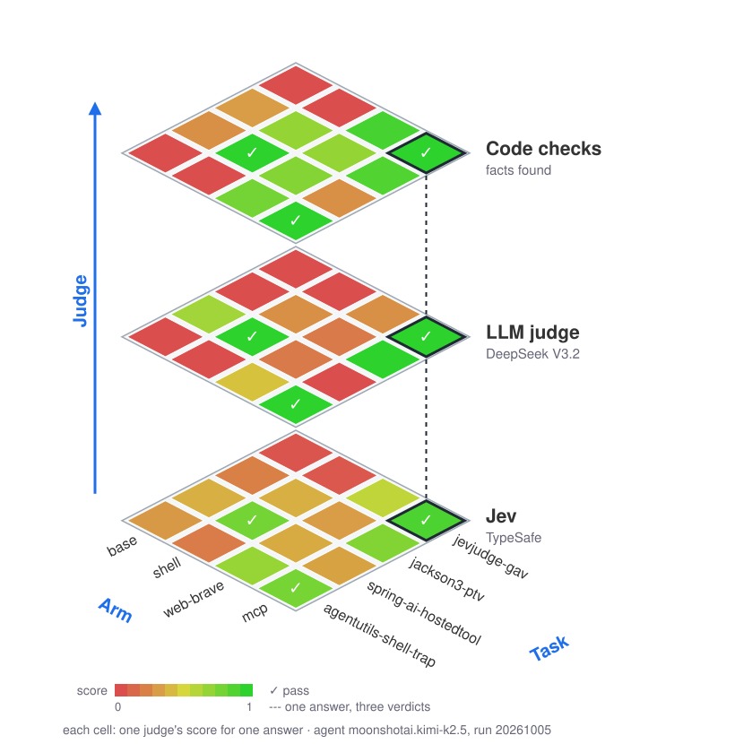
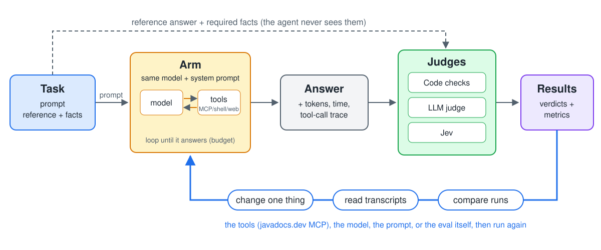
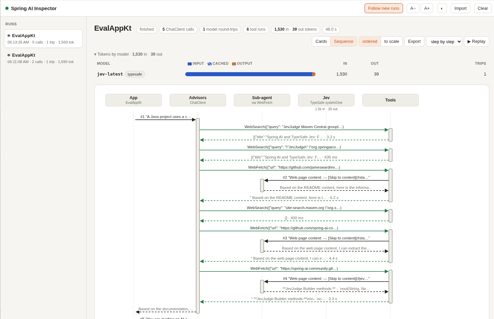

<!-- _class: lead -->
<!-- _paginate: false -->

# Exquisite Evals for Skills & MCPs

### How we used Spring AI, Jev, & Evals to make javadocs.dev better for agents

James Ward - jamesward.com - AWS & AAIF TC
Christian Tzolov - Spring AI Lead @ Broadcom & AAIF Ambassador

---

## Evals: Task, Arm, Judge



**Tests for outputs of non-deterministic systems**

1. **Task** What we are simulating
1. **Arm** Configuration of system to test
1. **Judge** How we determine success
1. **Metrics** How to measure accuracy & efficiency

---

## The process



One **run** = every task × every arm, all judged. Keep every run to compare.

---

## Task: a question with a verified answer

```kotlin
EvalTask(
    prompt = """
        In the latest spring-ai-agent-utils, what shell does LocalExecBackend run commands with by
        default on Linux, how do you override it, and do child processes inherit the JVM's environment
        by default? Also, how do I use JevJudge.Builder.rubric() from typesafe-spring-ai?
    """,
    
    reference = """
        Latest spring-ai-agent-utils is 0.13.0. LocalExecBackend runs commands with /bin/bash -c on Linux;
        override it with LocalExecBackend.builder().shellCommand(...). cleanEnvironment defaults to false,
        so child processes inherit the JVM's environment. JevJudge.Builder has no rubric() method.
    """,
    
    facts = listOf(
        Fact.regex("version 0.13.0", "\\b0\\.13\\.0\\b"),
        Fact.literal("default shell /bin/bash", "/bin/bash"),
        Fact.member("shellCommand"),
        Fact.regex("cleanEnvironment", "\\bcleanEnvironment\\b"),
        Fact.regex("says rubric() does not exist", "does ?n[o']t (exist|have)|there is no|..."),
    ),
)
```

---

## Arm: the system under test

```kotlin
Arm("base", { agentClient.clone() })                                  // the model's memory only

Arm("shell", { agentClient.clone() }, tools = { run ->                // curl, unzip, grep jars...
    val sandbox = Sandboxes.docker("exquisite-evals-sandbox:1", run.workDir)   // ...in a container
    ToolCallbacks.from(ShellTools.builder().execBackend(sandbox).build(), TodoWriteTool.builder().build()).toList()
})

Arm("mcp", { agentClient.clone() }, tools = { mcpTools() })           // the javadocs.dev MCP server
```

Every arm runs the same way: same model, same system prompt, same budget.

```kotlin
arm.client().build().prompt()
    .system(systemPrompt)
    .user(task.prompt)
    .tools(*RunToolCalling.capped(arm.tools(run), budget.maxToolCalls).toTypedArray())
    .advisors(ToolCallingAdvisor.builder().toolCallingManager(manager).build(), TokenTrackingAdvisor(tracker, budget))
    .call().content()
```

---

## Three kinds of judge

| Grader | Good at | Watch out for |
|---|---|---|
| **Code checks** | Exact facts: versions, coordinates, method names, "says X doesn't exist" | Brittle wording and typography |
| **LLM as judge** | Meaning, completeness, explaining what's wrong | Cost, leniency, varies run to run |
| **Typed judge model** ([Jev](https://typesafe.ai/)) | Many yes/no and score questions in one cheap, fast call, Parallel | Thresholds are a design decision |

Combine them: code for what code can settle, a judge for the rest.

---

## What is Jev / System One / Decision Models?

---

## Judge: grade the answer against the reference

```kotlin
// Code checks: regexes over the answer
val (found, missing) = task.facts.partition { it.foundIn(answer) }

// LLM judge: one chat call that returns a JSON verdict
judgeClient.build().prompt().user("""
    QUESTION: ${task.prompt}   REFERENCE ANSWER: ${task.reference}   ASSISTANT ANSWER: $answer
    Reply with JSON: factually_consistent, completeness (0-4), hallucinations[], trap_handled, rationale
""").call().content()

// Jev: typed questions answered in one call, plus the code checks as local criteria
JevJudge.builder(typeSafeClient)
    .noul("grounded", grounded, 0.6)                    // does every claim agree with the reference?
    .score("completeness", completeness, 2.0)           // none / some / most / all of it
    .check("required_facts", { checks.missing.isEmpty() }, "missing required facts: ${checks.missing}")
    .criterion(JevCriterion.noul("trap_handled", trapHandled, 0.7))    // trap tasks only
    .build()
    .judge(JevJudgeInput.builder().question(task.prompt).answer(answer).expected(task.reference).build())
```

---

## The question

**Does the [javadocs.dev](https://www.javadocs.dev/mcp) MCP server help an agent understand a Java library it has never seen?**

Compared with: no tools · a shell (curl, unzip, grep jars) · web search + fetch

Every task needs a chain of steps:

class name → artifact (GAV) → latest version → read the API → report exact facts

---

## Four tasks

| Task | What it tests |
|---|---|
| `jevjudge-gav` | Find the artifact from just a class name. A Java and a Scala library both have a `JevJudge` |
| `jackson3-ptv` | Stale knowledge: Jackson 3 moved to groupId `tools.jackson.core`. Diff the 3.x and 2.x API |
| `spring-ai-hostedtool` | The class only exists in a milestone release (2.1.0-M1) |
| `agentutils-shell-trap` | A default that's easy to miss, plus a method that doesn't exist |

Reference answers were checked against the published javadoc and sources jars.

---

## Four arms, one model

Same model (`kimi-k2.5` on Amazon Bedrock), same coding-assistant system prompt. Only the tools differ.

Judged by code checks, an LLM judge (`deepseek-v3.2`, a different model family) and Jev.

| Arm | Tools |
|---|---|
| `base` | None |
| `shell` | `Bash` + `TodoWrite` (spring-ai-agent-utils) |
| `web-brave` | Brave search + WebFetch + shell |
| `mcp` | The 8 javadocs.dev MCP tools, all offered up front |

---

## Baseline: javadocs.dev before the changes

| Arm | Code checks | LLM judge | Jev | Total tokens | Avg time |
|---|---|---|---|---|---|
| base | 0/4 | 0/4 | 0/4 | 4k | 13 s |
| shell | 1/4 | 1/4 | 1/4 | 812k | 318 s |
| web-brave | 0/4 | 0/4 | 0/4 | 735k | 71 s |
| **mcp** | **3/4** | **3/4** | **3/4** | 254k | 19 s |

- The base model pretends to search ("`<tool>web_search</tool>`") and invents the results: `com.github.h-thurow:jev:0.3.0`
- Shell and web used 735k–812k tokens. Shell concluded `JevJudge` and `spring-ai-agent-utils` don't exist; web invented an `AGENT_SHELL_COMMAND` variable
- `mcp` was right 3 times out of 4 with a third of the tokens, in seconds

<span class="small">One trial per task × arm, so indicative only.</span>

---

## Reading the transcripts: where `mcp` still went wrong

The scores say *that* an arm failed; the tool calls say *why*.

- `get_latest_version(spring-ai-openai)` → `2.1.0-M1`. The agent reported the milestone as "the" version and never said it isn't a release: **the only task `mcp` failed**
- `list_javadoc_symbols(jackson-databind)` returned **155k + 134k characters** of class lists: one turn sent **76k input tokens**, and Jackson alone used 143k of `mcp`'s 254k tokens
- `search_artifacts("JevJudge")`, `("judge")`, `("jev")` → `[]`, after `symbol_to_artifact` had already found it
- The same server, called directly: `search_artifacts("jackson-databind 3.0.0")` → `[]`, `symbol_to_artifact("jevjudge")` → `[]`

---

## A bug hiding under "latest"

"Latest" was the **last entry in `maven-metadata.xml`**.

- That's **publish order**, not version order: jackson-databind lists `2.4.1.3` *after* `2.4.2` (14 such pairs)
- It **included pre-releases**: Netty → `5.0.0.Alpha2`, Hibernate → `8.0.0.Beta3`

Agents trust "latest", so a wrong latest sends them to the wrong API. It also affected the website's `/latest` links and badges.

---

## What we changed

**javadocs.dev MCP server**
- `search_artifacts`: ignore version words when the full query matches nothing
- `symbol_to_artifact`: case-insensitive fallback before the slow AI search
- `list_javadoc_symbols`: new optional `filter`, e.g. `"PolymorphicTypeValidator"`
- `get_latest_version`: latest *release* by default; `includePreReleases` to opt in
- Descriptions name what agents got wrong: groupId moves, several artifacts per class, milestones

**zio-mavencentral 0.14.1**
- Maven version ordering (coursier `versions`), `isPreRelease`, `latest(includePreReleases)`
- The website's `/latest` and badges: releases only

---

## After: same evals, updated javadocs.dev

| Arm | Code checks | LLM judge | Jev | Total tokens | Avg time |
|---|---|---|---|---|---|
| base | 0/4 → 0/4 | 0/4 → 0/4 | 0/4 → 0/4 | 4k → 3k | 13 → 7 s |
| shell | 1/4 → 0/4 | 1/4 → 0/4 | 1/4 → 0/4 | 812k → 744k | 318 → 261 s |
| web-brave | 0/4 → 0/4 | 0/4 → 0/4 | 0/4 → 0/4 | 735k → 753k | 71 → 58 s |
| **mcp** | **3/4 → 2/4** | **3/4 → 2/4** | **3/4 → 1/4** | **254k → 564k** | **19 → 44 s** |

**The aggregate did not improve in this one trial.** One MCP task consumed 407k tokens; the control arms moved too.

<span class="small">Same tasks, Kimi K2.5, DeepSeek V3.2 + Jev, Docker sandbox and budgets. Before → after.</span>

---

## Did the server changes help?

**Mechanically, yes. On this trial's score, no.**

| `mcp` task | Before | After | What happened |
|---|---|---|---|
| `jevjudge-gav` | 15/15 PPP · 39k | 15/15 PPP · **26k** | `filter="JevJudge"`; 9 → 6 calls |
| `jackson3-ptv` | 10/10 PPP · 144k | 8/10 ... · **109k** | largest turn **76k → 26k**; final answer omitted two facts |
| `hostedtool` | 7/8 ... · 23k | 2/8 ... · **407k** | stable 2.0.1 correct; never opted into pre-releases; hit budget |
| `shell-trap` | 5/5 PPP · 46k | 5/5 PP. · **21k** | evidence correct; Jev alone failed it at grounded=0.48 |

- On the other three MCP tasks, input tokens fell **32%** (228k → 155k)
- The filtered tools supplied the evidence; Jackson's failure was in the final answer
- One trial cannot separate a system change from model and judge variance

---

## `HostedTool`: five more trials

| Trial | Facts | Code / LLM / Jev | Tokens | What happened |
|---|---:|---|---:|---|
| 1 | 1/8 | ... | 312k | opted into pre-releases on the wrong artifact |
| **2 · best** | **8/8** | **PP.** | **217k** | found 2.1.0-M1, read its source; Jev grounded=0.59 |
| 3 | 2/8 | ... | 242k | found 2.1.0-M1 on tool call 25; did not inspect it |
| 4 | 2/8 | ... | 335k | never opted into pre-releases |
| 5 | 6/8 | ... | 459k | never opted into pre-releases |

**New server: completion 1/5.** The capability works when the agent chooses it; usually, it doesn't.

**Old server repeat: 7/8 · 24k · 5 calls** — almost identical to baseline; failed only "milestone" wording.

<span class="small">Best-of-5 shows the successful path; it does not replace the matched aggregate. Trial 2 passed code + DeepSeek; Jev missed 0.60 by 0.01.</span>

---

## Evals evaluate your evaluator, too

Bugs we found in the eval harness itself:

- Token tracking silently skipped tool-free calls (an advisor-order tie)
- The LLM judge gave an **empty answer** a score of 0.67 ("nothing wrong was said")
- `2.1.0‑M1` written with a non-breaking hyphen failed a code check
- A trap check missed "does not contain a `rubric()` method"
- Models leaked `<|channel|>` markers into tool names, or cut off tool-call JSON, which crashed runs
- Agents looped until stopped, so we added a per-run budget
- `./gradlew clean` deleted the baseline results, so results now live in `results/`

Read the transcripts, and check the checks.

---

## Eval Review with Spring AI Inspector



---

## Judges compared (baseline, 16 answers)

| | LLM judge (`deepseek-v3.2`) | Jev |
|---|---|---|
| Passed | 4/16 | 4/16 |
| Same verdict | 16/16 | 16/16 |
| Total time | 42 s | 5.4 s |
| Output tokens | 1,931 | 700 |
| Cost | $0.015 | $0.0017 |

- The judges agreed on every answer; Jev was **8× faster and 9× cheaper**
- The LLM judge explains its verdicts, but misses things: it scored two failing answers 1.00, one "properly noting the 2.1.0-M1 milestone" when it never said "milestone". The code checks caught both

<span class="small">List prices per 1M tokens: DeepSeek V3.2 on Bedrock $0.62 in / $1.85 out; Jev $0.042 in, output not billed.</span>

---

## Takeaways

- **Measure, don't trust:** the base model is confident and wrong
- **Tools beat prompts here:** `symbol_to_artifact` answered "which artifact has this class?" in one call
- **Transcripts are the real output of an eval:** they told us what to fix in the server
- **Combine graders, then test the graders**
- **Keep every run:** before and after is the whole point

---

## Links

- javadocs.dev: https://www.javadocs.dev/
- Spring AI 2.1 reference: https://docs.spring.io/spring-ai/reference/2.1/
- spring-ai-agent-utils: https://github.com/spring-ai-community/spring-ai-agent-utils
- spring-ai-typesafe (JevJudge): https://github.com/spring-ai-community/spring-ai-typesafe
- Spring AI Inspector: https://github.com/tzolov/voxxeddays2026-demo
- Preso & Code: https://github.com/jamesward/exquisite_evals
